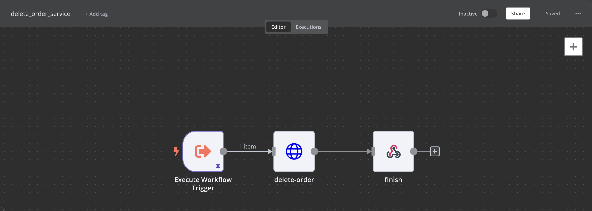

# Low code for poc self-host

n8n low code platform just simulate purchase order service


## Installation

Require Docker and Artillery

```bash
    brew install --cask docker
    npm install -g artillery
```


## Run Locally

Clone the project

```bash
  git git@github.com:snilli/n8n.git
```

Go to the project directory

```bash
  cd n8n
```

Start the server

```bash
  docker-compose up -d
```

Start with go to [http://localhost:5678/](http://localhost:5678/) and Login with

```txt
    username: test@test.com
    password: Test1234
```

provide 2 http endpoints
```txt
    /webhook/hello  # for run main process
    /webhook/load   # for test connect postgres
```

## Appendix

### Webhook

Provide webhook endpoint

### Http Client

Provide http request for call api 

### If

Provide condition thinking true and false

### Execute Workflow

Provide workflow execution just pass workflow id that need to execute

### Json editor

Provide manipulate json

### Webhook response

Provide manipulate data to response to webhook endpoint

---

## Flow scenarios

### Create Order Flow

This flow is provide web hook endpoint for create order and forward to order id to pay service


### Pay service Flow

This flow is receive order id to paid order


### Paid Error handler Flow

This flow is handle paid error just stamp that order error to redis then publish message to redis pubsub for retry  paid again. if retry more that 3 times move that order to dlq and delete order error key


### Retry paid flow

This flow is subscript message from redis pubsub when call pay service agian


### Compensate flow

This flow is manual flow just click in flow for run get all order-dlq keys to calls delete order


### Delete Order Service flow

This flow is just receive order id to call delete order service


### Inquery postgres flow

This flow is just inquery to postgres table customer you can edit select condition


## Load Test 
[artillery](https://www.artillery.io/)
This project use artillery for tool load test script in dir loadtests.

```bash
  cd loadtests
  artillery run ./n8n-test.yaml -o ./result.json
```

Convert json to html report when finish can open that html for see.

```bash
  artillery report ./result.json
```

## FAQ

#### Q: n8n error when first time run docker-compose up

A: Just wait postgres container run init script finish then restart n8n container

#### Q: If mock server is return wrong reponse

A: Just restart that service